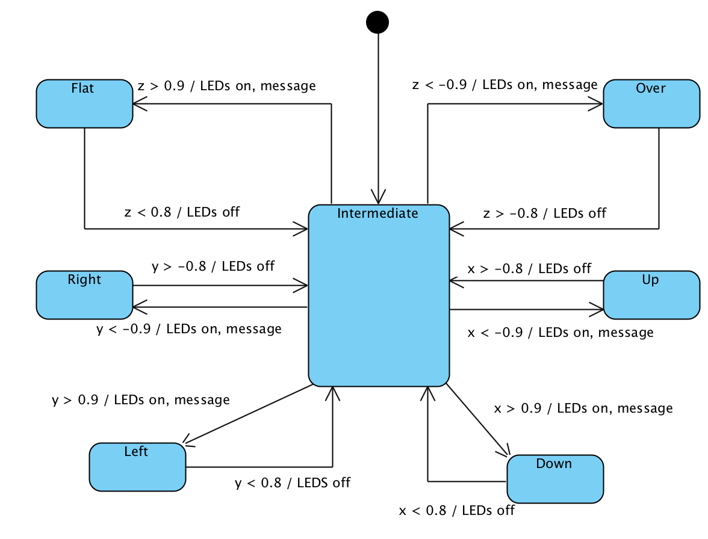

# Given code for lab 5

The project uses a serial data link (over USB) to a terminal emulator running on the
connected PC / laptop.
  * The accelerometer is polled every 2 seconds
  * The X, Y and Z acceleration values are printed as proportions of g (the acceleration due to gravity)
  * The green LED is toggled on every poll

The project uses a single thread.

The project includes the code for the serial interface. This API has two functions:
   1. `sendMsg` which write a message to the terminal
   2. `readLine` which reads a line from the terminal (not used here)

The project includes code for the accelerometer. This API has two functions:
   1. `initAccel` initialises the accelerometer
   2. `readXYZ` reads the three accelerations

The lab requirements include an implementation of the following state transition diagram:

